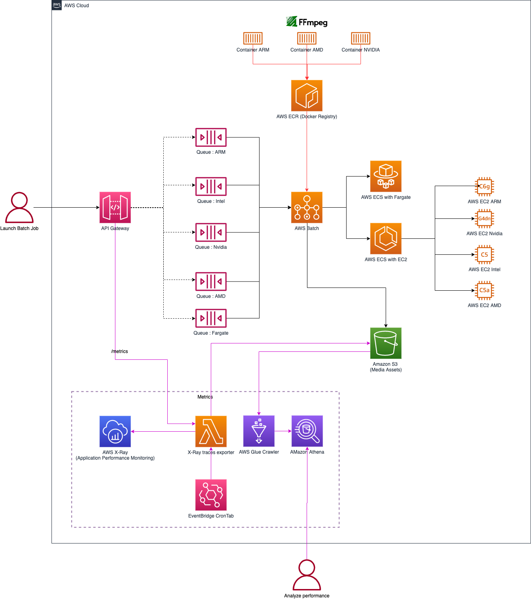
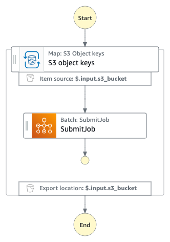
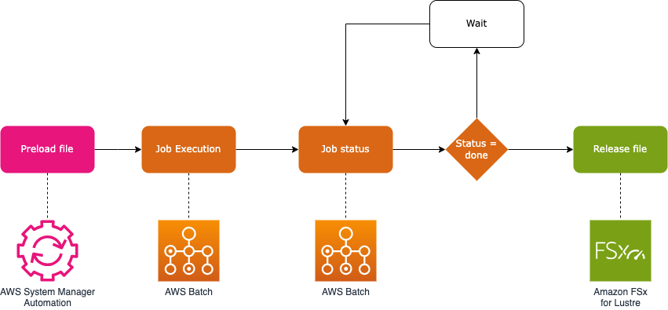
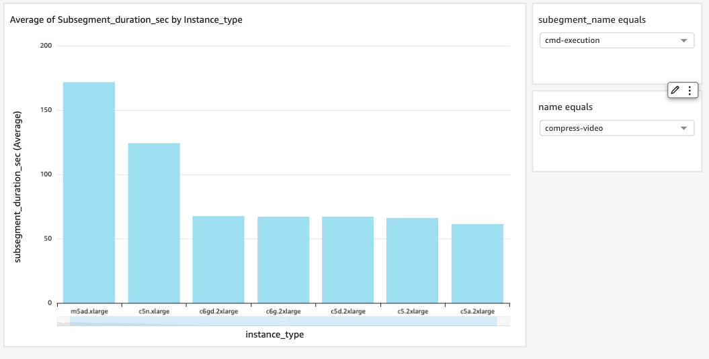

# Create a managed FFmpeg workflow for your media jobs using AWS Batch

_Blog post : <https://aws.amazon.com/blogs/opensource/create-a-managed-ffmpeg-workflow-for-your-media-jobs-using-aws-batch/>_

## Table of Contents
<!--TOC-->

- [Create a managed FFmpeg workflow for your media jobs using AWS Batch](#create-a-managed-ffmpeg-workflow-for-your-media-jobs-using-aws-batch)
  - [Table of Contents](#table-of-contents)
  - [Introduction](#introduction)
  - [Disclaimer And Data Privacy Notice](#disclaimer-and-data-privacy-notice)
  - [Architecture](#architecture)
    - [Architecture Decision Records](#architecture-decision-records)
    - [Diagram](#diagram)
  - [Install](#install)
    - [Prerequisites](#prerequisites)
  - [Deploy the solution with AWS CDK](#deploy-the-solution-with-aws-cdk)
  - [Use the solution](#use-the-solution)
    - [Use the solution at scale with AWS Step Functions](#use-the-solution-at-scale-with-aws-step-functions)
    - [Use the solution with Amazon FSx for Lustre cluster](#use-the-solution-with-amazon-fsx-for-lustre-cluster)
    - [Extend the solution](#extend-the-solution)
  - [Performance and quality metrics](#performance-and-quality-metrics)
  - [Cost](#cost)
  - [Development](#development)
  - [Clean up](#clean-up)

<!--TOC-->

## Introduction

[FFmpeg](https://ffmpeg.org/) is an open source, industry standard utility for handling video. To use FFmpeg on AWS, customers must maintain FFmpeg themselves on EC2 and build workflow managers to ingest and process media. This solution integrates FFmpeg with AWS services to create a managed offering. It packages FFmpeg commands in containers, managed by [AWS Batch](https://aws.amazon.com/batch/). Customers can then execute FFmpeg jobs through a REST API.

AWS Batch is a fully managed service that enables developers to run hundreds of thousands of batch computing jobs on AWS. It automatically provisions the optimal quantity and type of compute resources, without the need for you to install and manage batch computing software or server clusters.

This solution improves usability and control. It relieves the burden of maintaining open source software and building custom workflow managers. Customers benefit from reduced costs and learning curves.

AWS proposes several general usage instance families, optimised compute instance families and 14 accelerated computes. By correlating each instance family specification with FFmpeg hardware acceleration API, we understand it is possible to optimize the performance of FFmpeg:

- **NVIDIA with Intel** GPU-powered Amazon EC2 instances: G4dn instance family is powered by NVIDIA T4 GPUs and Intel Cascade Lake CPUs. G5 instance family is powered by NVIDIA A10G Tensor Core GPU. These GPUs are well suited for video encoding workloads and offer enhanced hardware-based encoding/decoding (NVENC/NVDEC). This blog post ['Optimizing video encoding with FFmpeg using NVIDIA GPU-based Amazon EC2 instances'](https://aws.amazon.com/blogs/compute/optimizing-video-encoding-with-ffmpeg-using-nvidia-gpu-based-amazon-ec2-instances/) compares video encoding performance between CPUs and Nvidia GPUs and to determine the price/performance ratio in different scenarios.
- **Xilinx with Intel** media accelerator cards: VT1 instances are powered by up to 8 Xilinx® Alveo™ U30 media accelerator cards and support up to 96 vCPUs, 192GB of memory, 25 Gbps of enhanced networking, and 19 Gbps of EBS bandwidth. The [Xilinx Video SDK includes an enhanced version of FFmpeg](https://xilinx.github.io/video-sdk/v1.5/using_FFmpeg.html) that can communicate with the hardware accelerated transcode pipeline in Xilinx devices. As [described in this benchmark](https://aws.amazon.com/fr/blogs/opensource/run-open-source-ffmpeg-at-lower-cost-and-better-performance-on-a-vt1-instance-for-vod-encoding-workloads/), VT1 instances can encode VOD assets up to 52% faster, and achieve up to 75% reduction in cost when compared to C5 and C6i instances.
- EC2 instances powered by **Intel**: M6i/C6i instances are powered by 3rd generation Intel Xeon Scalable processors (code named Ice Lake) with an all-core turbo frequency of 3.5 GHz.
- EC2 instances powered by **AWS Graviton**: Encoding video on C7g instances, the last [AWS Graviton processor family](https://aws.amazon.com/ec2/graviton/), costs measured 29% less for H.264 and 18% less for H.265 compared to C6i, as described in this blog post ['Optimized Video Encoding with FFmpeg on AWS Graviton Processors'](https://aws.amazon.com/fr/blogs/opensource/optimized-video-encoding-with-ffmpeg-on-aws-graviton-processors/)
- EC2 instances powered by **AMD**: M6a instances are powered by 3rd generation AMD EPYC processors (code named Milan).
- Serverless compute with **Fargate**: Fargate allows to have a completely serverless architecture for your batch jobs. With Fargate, every job receives the exact amount of CPU and memory that it requests.

## Disclaimer And Data Privacy Notice

When you deploy this solution, scripts will download different packages with different licenses from various sources. These sources are not controlled by the developer of this script. Additionally, this script can create a non-free and un-redistributable binary. By deploying and using this solution, you are fully aware of this.

## Architecture

The architecture includes 5 main components:

1. Containers images are stored in a Amazon ECR (Elastic Container Registry) registry. Each container includes FFmpeg library with a Python wrapper. Container images are specialized per CPU architecture: ARM64, x86-64, NVIDIA, and Xilinx.
2. AWS Batch is configured with a queue and compute environment per CPU architecture. AWS Batch schedules job queues using Spot Instance compute environments only, to optimize cost.
3. Customers submit jobs through AWS SDKs with the `SubmitJob` operation or use the Amazon API Gateway REST API to easily submit a job with any HTTP library.
4. All media assets ingested and produced are stored on an Amazon S3 bucket.
5. [Amazon FSx for Lustre](https://aws.amazon.com/fr/fsx/lustre/) seamlessly integrates with Amazon S3, enabling transparent access to S3 objects as files. Amazon FSx for Lustre is ideally suited for temporary storage and short-term data processing due to its configuration as a Scratch file system. This eliminates the need to move large media assets to local storage.
6. Observability is managed by Amazon Cloudwatch and AWS X-Ray. All XRay traces are exported on Amazon S3 to benchmark which compute architecture is better for a specific FFmpeg command.
7. [Amazon Step Functions](https://aws.amazon.com/step-functions/) reliably processes huge volumes of media assets with FFmpeg on AWS Batch. It handles job failures, and AWS service limits.

### Architecture Decision Records

1. [Implement Athena Views](doc/architecture/0001-implement-athena-views.md)
2. [Implement automatic list of instance types per AWS Region](doc/architecture/0002-implement-automatic-list-of-instance-types-per-aws-region.md)
3. [Rollback automatic list of instance types per AWS Region](doc/architecture/0003-rollback-automatic-list-of-instance-types-per-aws-region.md)
4. [Implement Step Functions Dynamic Map](doc/architecture/0004-implement-step-functions-dynamic-map.md)
5. [Implement FSx Lustre Scratch cluster](doc/architecture/0005-implement-fsx-lustre-scratch-cluster.md)

### Diagram



## Install

### Prerequisites

You need the following prerequisites to set up the solution:

- An AWS account
- Latest version of [AWS Cloud Development Kit (CDK)](https://docs.aws.amazon.com/cdk/v2/guide/getting_started.html) with a [bootstrapping](https://docs.aws.amazon.com/cdk/v2/guide/bootstrapping.html) already done
- Latest version of [Task](https://taskfile.dev/#/installation)
- Latest version of [Docker](https://docs.docker.com/get-docker/)
- Latest version of [Python 3](https://www.python.org/downloads/)

## Deploy the solution with AWS CDK

To deploy the solution on your account, complete the following steps:

1. Clone the github repository <http://github.com/aws-samples/aws-batch-with-FFmpeg/>
2. Execute this list of commands:

```bash
task setup
source .venv/bin/activate
task cdk:deploy
task env
task app:docker:login
task app:docker:build:amd64
task app:docker:build:arm64
task app:docker:build:nvidia
task app:docker:build:xilinx
```

CDK will output the new Amazon S3 bucket and the Amazon API Gateway REST endpoint.

## Use the solution

The solution supports FFmpeg commands through AWS SDKs, AWS CLI, or HTTP REST API. It follows the typical FFmpeg command syntax from the [official documentation](https://ffmpeg.org/ffmpeg.html):

```bash
ffmpeg [global_options] {[input_file_options] -i input_url} ... {[output_file_options] output_url} ...
```

Parameters:

- `global_options`: FFmpeg global options described in the official documentation
- `input_file_options`: FFmpeg input file options described in the official documentation
- `input_url`: AWS S3 url synced to the local storage and transformed to local path by the solution
- `output_file_options`: FFmpeg output file options described in the official documentation
- `output_url`: AWS S3 url synced from the local storage to AWS S3 storage
- `compute`: Instances family used to compute the media asset: `intel`, `arm`, `amd`, `nvidia`, `fargate`, `fargate-arm`, `xilinx`
- `name`: metadata of this job for observability

Available FFmpeg versions per compute environment:

| **Compute** | **FFmpeg version per default** | **FFmpeg version(s) available** |
|-------------|--------------------------------|---------------------------------|
| intel       | 7.0.1                         | 6.0, 5.1                       |
| arm         | 7.0.1                         | 6.0, 5.1                       |
| amd         | 7.0.1                         | 6.0, 5.1                       |
| nvidia      | 7.0 (snapshot)                | 6.0, 5.1                       |
| fargate     | 7.0.1                         | 6.0, 5.1                       |
| fargate-arm | 7.0.1                         | 6.0, 5.1                       |
| xilinx      | 4.4                           | 4.4                            |

Example using AWS SDK (Python):

```python
import boto3
import requests
from urllib.parse import urlparse
from aws_requests_auth.boto_utils import BotoAWSRequestsAuth

# Cloudformation output of the Amazon S3 bucket created by the solution: s3://batch-FFmpeg-stack-bucketxxxx/
s3_bucket_url = "<S3_BUCKET>"
# Amazon S3 key of the input media asset: test/myvideo.mp4
s3_key_input = "<MEDIA_ASSET>"
# Amazon S3 key for the output: test/output.mp4
s3_key_output = "<MEDIA_ASSET>"
# EC2 instance family: `intel`, `arm`, `amd`, `nvidia`, `fargate`, `xilinx`
compute = "intel"
job_name = "clip-video"

command = {
    "name": job_name,
    "input_url": s3_bucket_url + s3_key_input,
    "output_url": s3_bucket_url + s3_key_output,
    "output_file_options": "-ss 00:00:10 -t 00:00:15 -c:v copy -c:a copy"
}

# Submit job using AWS SDK
batch = boto3.client("batch")
result = batch.submit_job(
    jobName=job_name,
    jobQueue="batch-ffmpeg-job-queue-" + compute,
    jobDefinition="batch-ffmpeg-job-definition-" + compute,
    parameters=command,
)
```

You can also use the REST API:

```python
# AWS Signature Version 4 Signing process
def apig_iam_auth(rest_api_url):
    domain = urlparse(rest_api_url).netloc
    auth = BotoAWSRequestsAuth(
        aws_host=domain, aws_region="<AWS_REGION>", aws_service="execute-api"
    )
    return auth

api_endpoint = "<API_ENDPOINT>"
auth = apig_iam_auth(api_endpoint)
url = api_endpoint + 'batch/execute/' + compute
response = requests.post(url=url, json=command, auth=auth, timeout=2)
```

To specify an instance type:

```python
instance_type = 'c5.large'
result = batch.submit_job(
    jobName=job_name,
    jobQueue="batch-ffmpeg-job-queue-" + compute,
    jobDefinition="batch-ffmpeg-job-definition-" + compute,
    parameters=command,
    nodeOverrides={
        "nodePropertyOverrides": [
            {
                "targetNodes": "0,n",
                "containerOverrides": {
                    "instanceType": instance_type,
                },
            },
        ]
    },
)
```

To have the status of the AWS Batch job execution with the AWS API [Batch::DescribeJobs](https://docs.aws.amazon.com/batch/latest/APIReference/API_DescribeJobs.html) and with the HTTP REST API ([API Documentation](doc/api.md)):

```python
command['instance_type'] = instance_type
url= api_endpoint + '/batch/describe'
response = requests.post(url=url, json=command, auth=auth, timeout=2)
```

### Use the solution at scale with AWS Step Functions

Process large volumes of media assets using AWS Step Functions. The workflow can handle hundreds of thousands of files efficiently.



Example using AWS CLI:

```json
{
  "name": "pytest-sdk-audio",
  "compute": "intel",
  "input": {
    "s3_bucket": "<s3_bucket>",
    "s3_prefix": "media-assets/",
    "file_options": "null"
  },
  "output": {
    "s3_bucket": "<s3_bucket>",
    "s3_prefix": "output/",
    "s3_suffix": "",
    "file_options": "-ac 1 -ar 48000"
  },
  "global": {
    "options": "null"
  }
}
```

Parameters of this `input.json are:

- `$.name`: metadata of this job for observability.
- `$.compute`: Instances family used to compute the media asset : `intel`, `arm`, `amd`, `nvidia`, `xilinx`, `fargate`, `fargate-arm`.
- `$.input.s3_bucket` and `$.input.s3_prefix`: S3 url of the list of Amazon S3 Objects to be processed by FFMPEG.
- `$.input.file_options`: FFmpeg input file options described in the official documentation.
- `$.output.s3_bucket` and `$.output.s3_prefix`: S3 url where all processed media assets will be stored on Amazon S3.
- `$.output.s3_suffix` : Suffix to add to all processed media assets which will be stored on an Amazon S3 Bucket
- `$.output.file_options`: FFmpeg output file options described in the official documentation.
- `$.global.options`: FFmpeg global options described in the official documentation.

Submit this FFmpeg command described in JSON input file with the AWS CLI :

```bash
aws stepfunctions start-execution \
  --state-machine-arn arn:aws:states:<region>:<accountid>:stateMachine:batch-ffmpeg-state-machine \
  --name batch-ffmpeg-execution \
  --input "$(jq -R . input.json --raw-output)"
```

The Amazon S3 url of the processed media is: `s3://{$.output.s3_bucket}{$.output.s3_suffix}{Input S3 object key}{$.output.s3_suffix}`

### Use the solution with Amazon FSx for Lustre cluster

For efficient processing of large media files, the solution supports Amazon FSx for Lustre integration. Enable this feature in `/cdk.json`:

```json
{
    "batch-ffmpeg:lustre-fs": {
      "enable": true,
      "storage_capacity_gi_b": 1200
    }
}
```

The FFmpeg wrapper transparently converts S3 URLs to lustre filesystem requests when enabled. The integration requires no code changes.

This feature is not available with `fargate` (<https://github.com/aws/containers-roadmap/issues/650>) and `xilinx` (<https://github.com/Xilinx/video-sdk/issues/85>)

Lustre filesystem file manipulation (preload and release) occurs through the Amazon API Gateway Rest API calls ([API Documentation](doc/api.md)). This enables full integration into media supply chain workflows.



The solution deployed an AWS System Manager Document `batch-ffmpeg-lustre-preload` which preloads a media asset in the Lustre filesystem. This SSM Document is available through the Amazon API Gateway Rest API ([API Documentation](doc/api.md)).

To release files on the FSx for Lustre filesystem, use the AWS API [Amazon FSx::CreateDataRepositoryTask](https://docs.aws.amazon.com/fsx/latest/APIReference/API_CreateDataRepositoryTask.html) with the type of data repository task `RELEASE_DATA_FROM_FILESYSTEM` or the Amazon API Gateway Rest API ([API Documentation](doc/api.md)).

### Extend the solution

The solution is highly customizable:

- Customize FFmpeg docker images in [`src/docker-images/`](https://github.com/aws-samples/aws-batch-with-FFmpeg/tree/main/src/docker-images/)
- Modify the FFmpeg wrapper in `/src/wrapper/wrapper.py`
- Extend the CDK infrastructure in `/infrastructure`

## Performance and quality metrics

The solution provides comprehensive performance monitoring through AWS X-Ray with three key segments:

- Amazon S3 download
- FFmpeg Execution
- Amazon S3 upload

Quality metrics (PSNR, SSIM, VMAF) can be enabled by setting the AWS SSM Parameter `/batch-ffmpeg/ffqm` to `TRUE`. Metrics are:

- Exported as AWS X-RAY metadata
- Saved as JSON files in the S3 bucket under `/metrics/ffqm`
- Available through AWS Athena views:
  - `batch_ffmpeg_ffqm_psnr`
  - `batch_ffmpeg_ffqm_ssim`
  - `batch_ffmpeg_ffqm_vmaf`
  - `batch_ffmpeg_xray_subsegment`

Create custom dashboards using Amazon QuickSight:



## Cost

AWS Batch optimizes costs by:

- Pay-per-use model - only pay for resources when jobs are running
- Spot instance support for up to 90% cost savings
- Automatic instance selection and scaling
- Support for various instance types to optimize price/performance

## Development

For development and testing:

1. Install development dependencies:

```bash
task setup
source .venv/bin/activate
```

## Clean up

To avoid unwanted charges:

1. Delete all objects in the S3 bucket used for testing
2. Destroy the AWS CDK stack: ```task cdk:destroy```
3. Verify all resources have been removed through the AWS console
