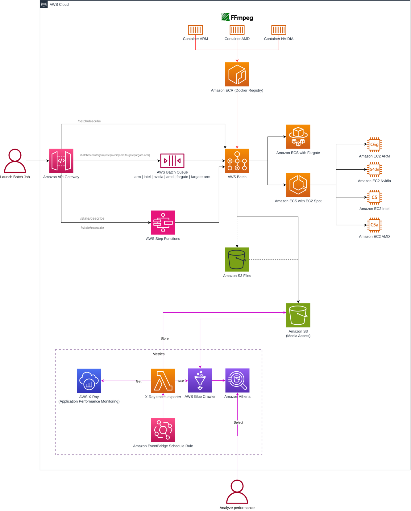
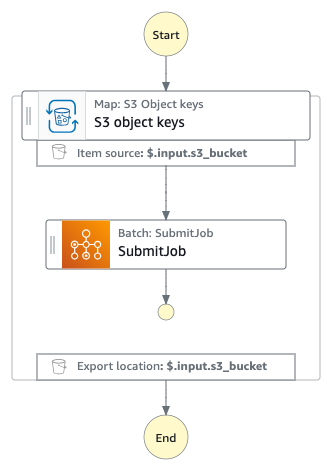
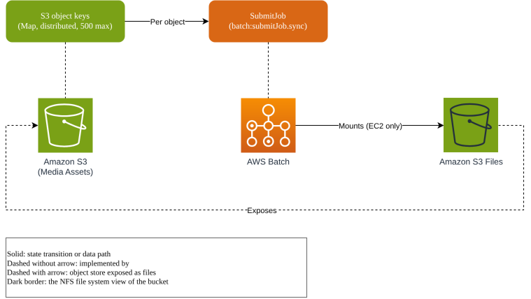
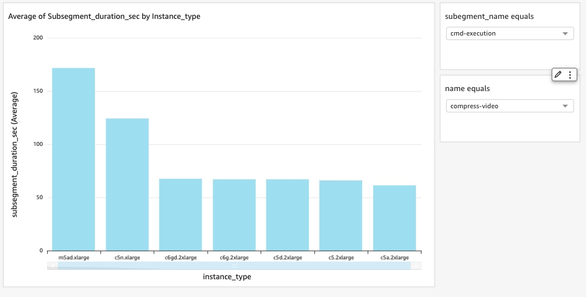

# Create a managed FFmpeg workflow for your media jobs using AWS Batch

_Blog post : <https://aws.amazon.com/blogs/opensource/create-a-managed-ffmpeg-workflow-for-your-media-jobs-using-aws-batch/>_

## Table of Contents
<!--TOC-->

- [Create a managed FFmpeg workflow for your media jobs using AWS Batch](#create-a-managed-ffmpeg-workflow-for-your-media-jobs-using-aws-batch)
  - [Table of Contents](#table-of-contents)
  - [Introduction](#introduction)
  - [Disclaimer And Data Privacy Notice](#disclaimer-and-data-privacy-notice)
  - [Architecture](#architecture)
    - [Architecture Decision Records](#architecture-decision-records)
    - [Diagram](#diagram)
  - [Install](#install)
    - [Prerequisites](#prerequisites)
  - [Deploy the solution with AWS CDK](#deploy-the-solution-with-aws-cdk)
    - [Troubleshooting the deployment](#troubleshooting-the-deployment)
  - [Use the solution](#use-the-solution)
    - [Multiple input files](#multiple-input-files)
    - [Use the solution at scale with AWS Step Functions](#use-the-solution-at-scale-with-aws-step-functions)
    - [Use the solution with an Amazon S3 Files shared file system](#use-the-solution-with-an-amazon-s3-files-shared-file-system)
    - [Extend the solution](#extend-the-solution)
  - [Performance and quality metrics](#performance-and-quality-metrics)
  - [Cost](#cost)
  - [Development](#development)
  - [Clean up](#clean-up)

<!--TOC-->

## Introduction

[FFmpeg](https://ffmpeg.org/) is an open source, industry standard utility for handling video. To use FFmpeg on AWS, customers must maintain FFmpeg themselves on EC2 and build workflow managers to ingest and process media. This solution integrates FFmpeg with AWS services to create a managed offering. It packages FFmpeg commands in containers, managed by [AWS Batch](https://aws.amazon.com/batch/). Customers can then execute FFmpeg jobs through a REST API.

AWS Batch is a fully managed service that enables developers to run hundreds of thousands of batch computing jobs on AWS. It automatically provisions the optimal quantity and type of compute resources, without the need for you to install and manage batch computing software or server clusters.

This solution improves usability and control. It relieves the burden of maintaining open source software and building custom workflow managers. Customers benefit from reduced costs and learning curves.

AWS proposes several general usage instance families, optimised compute instance families and 14 accelerated computes. By correlating each instance family specification with FFmpeg hardware acceleration API, we understand it is possible to optimize the performance of FFmpeg:

- **NVIDIA with Intel** GPU-powered Amazon EC2 instances: G4dn instance family is powered by NVIDIA T4 GPUs and Intel Cascade Lake CPUs. G5 instance family is powered by NVIDIA A10G Tensor Core GPU. These GPUs are well suited for video encoding workloads and offer enhanced hardware-based encoding/decoding (NVENC/NVDEC). This blog post ['Optimizing video encoding with FFmpeg using NVIDIA GPU-based Amazon EC2 instances'](https://aws.amazon.com/blogs/compute/optimizing-video-encoding-with-ffmpeg-using-nvidia-gpu-based-amazon-ec2-instances/) compares video encoding performance between CPUs and Nvidia GPUs and to determine the price/performance ratio in different scenarios.
- EC2 instances powered by **Intel**: M6i/C6i instances are powered by 3rd generation Intel Xeon Scalable processors (code named Ice Lake) with an all-core turbo frequency of 3.5 GHz.
- EC2 instances powered by **AWS Graviton**: Encoding video on C7g instances, the last [AWS Graviton processor family](https://aws.amazon.com/ec2/graviton/), costs measured 29% less for H.264 and 18% less for H.265 compared to C6i, as described in this blog post ['Optimized Video Encoding with FFmpeg on AWS Graviton Processors'](https://aws.amazon.com/fr/blogs/opensource/optimized-video-encoding-with-ffmpeg-on-aws-graviton-processors/)
- EC2 instances powered by **AMD**: M6a instances are powered by 3rd generation AMD EPYC processors (code named Milan).
- Serverless compute with **Fargate**: Fargate allows to have a completely serverless architecture for your batch jobs. With Fargate, every job receives the exact amount of CPU and memory that it requests.

## Disclaimer And Data Privacy Notice

When you deploy this solution, scripts will download different packages with different licenses from various sources. These sources are not controlled by the developer of this script. Additionally, this script can create a non-free and un-redistributable binary. By deploying and using this solution, you are fully aware of this.

## Architecture

The architecture includes 7 main components:

1. Containers images are stored in a Amazon ECR (Elastic Container Registry) registry. Each container includes FFmpeg library with a Python wrapper. Container images are specialized per CPU architecture: ARM64, x86-64, and NVIDIA.
2. AWS Batch is configured with a queue and compute environment per CPU architecture. AWS Batch schedules job queues using Spot Instance compute environments only, to optimize cost.
3. Customers submit jobs through AWS SDKs with the `SubmitJob` operation or use the Amazon API Gateway REST API to easily submit a job with any HTTP library.
4. All media assets ingested and produced are stored on an Amazon S3 bucket.
5. [Amazon S3 Files](https://docs.aws.amazon.com/AmazonS3/latest/userguide/s3-files.html) exposes the objects of that bucket as a shared NFS file system, enabling transparent access to S3 objects as files. It provisions no storage of its own, which suits an intermittent workload: media assets are processed in place instead of being copied to local storage.
6. Observability is managed by Amazon Cloudwatch and AWS X-Ray. All XRay traces are exported on Amazon S3 to benchmark which compute architecture is better for a specific FFmpeg command.
7. [Amazon Step Functions](https://aws.amazon.com/step-functions/) reliably processes huge volumes of media assets with FFmpeg on AWS Batch. It handles job failures, and AWS service limits.

### Architecture Decision Records

1. [Implement Athena Views](doc/architecture/0001-implement-athena-views.md)
2. [Implement automatic list of instance types per AWS Region](doc/architecture/0002-implement-automatic-list-of-instance-types-per-aws-region.md)
3. [Rollback automatic list of instance types per AWS Region](doc/architecture/0003-rollback-automatic-list-of-instance-types-per-aws-region.md)
4. [Implement Step Functions Dynamic Map](doc/architecture/0004-implement-step-functions-dynamic-map.md)
5. [Implement FSx Lustre Scratch cluster](doc/architecture/0005-implement-fsx-lustre-scratch-cluster.md) (superseded by 6)
6. [Replace FSx for Lustre with Amazon S3 Files](doc/architecture/0006-replace-fsx-lustre-with-amazon-s3-files.md)

### Diagram



## Install

### Prerequisites

You need the following prerequisites to set up the solution:

- An AWS account
- Latest version of [AWS Cloud Development Kit (CDK)](https://docs.aws.amazon.com/cdk/v2/guide/getting_started.html) with a [bootstrapping](https://docs.aws.amazon.com/cdk/v2/guide/bootstrapping.html) already done
- Latest version of [Task](https://taskfile.dev/#/installation)
- Latest version of [Docker](https://docs.docker.com/get-docker/)
- Latest version of [Python 3](https://www.python.org/downloads/)
- [uv](https://docs.astral.sh/uv/getting-started/installation/), which `task setup` uses to install the security scanner in its own environment rather than in the project one

`task setup` then provisions the rest, so nothing below has to be installed by
hand: the virtual environment and the Python dependencies, [hadolint](https://github.com/hadolint/hadolint)
which the pre-commit hook of the same name calls as a binary, and the
[Automated Security Helper](https://github.com/awslabs/automated-security-helper)
that `task security:ash` runs. Both are pinned, and ASH is taken from its own
repository: the `automated-security-helper` name on PyPI is squatted by an
unrelated placeholder package. `~/.local/bin` has to be on the `PATH` for the
two binaries to be found.

## Deploy the solution with AWS CDK

To deploy the solution on your account, complete the following steps:

1. Clone the github repository <http://github.com/aws-samples/aws-batch-with-FFmpeg/>
2. Execute this list of commands:

```bash
task setup
source .venv/bin/activate
task cdk:deploy
task env
task app:docker:login
task app:docker:build:amd64
task app:docker:build:arm64
task app:docker:build:nvidia
```

CDK will output the new Amazon S3 bucket and the Amazon API Gateway REST endpoint.

### Troubleshooting the deployment

- **`task cdk:deploy` fails with `error: unexpected argument '--all' found`** — the
  `cdk` command on your `PATH` is **not** the AWS CDK CLI (another tool named `cdk`
  is shadowing it). Check with `cdk --version`: the AWS CDK prints a version like
  `2.x.y (build ...)`. If it prints something else, install the AWS CDK CLI
  (`npm install -g aws-cdk`) or invoke it explicitly with `npx aws-cdk`, and make
  sure its location comes first on your `PATH`.
- **`Could not open requirements file: tests/requirements.txt`** — run `task setup`
  from the repository root (not from a subdirectory); the file is present in the
  repository and installed automatically by the setup task.

## Use the solution

The solution supports FFmpeg commands through AWS SDKs, AWS CLI, or HTTP REST API. It follows the typical FFmpeg command syntax from the [official documentation](https://ffmpeg.org/ffmpeg.html):

```bash
ffmpeg [global_options] {[input_file_options] -i input_url} ... {[output_file_options] output_url} ...
```

Parameters:

- `global_options`: FFmpeg global options described in the official documentation
- `input_file_options`: FFmpeg input file options described in the official documentation
- `input_url`: AWS S3 url synced to the local storage and transformed to local path by the solution
- `output_file_options`: FFmpeg output file options described in the official documentation
- `output_url`: AWS S3 url synced from the local storage to AWS S3 storage
- `compute`: Instances family used to compute the media asset: `intel`, `arm`, `amd`, `nvidia`, `fargate`, `fargate-arm`
- `name`: metadata of this job for observability

### Multiple input files

`input_url` accepts **several Amazon S3 URLs separated by commas** (no spaces). The
solution downloads each one and passes them to FFmpeg in order, as successive
`-i` inputs. This is useful to combine, for example, an image and an audio track,
or to concatenate clips.

```python
command = {
    "name": "image-plus-audio",
    # Two inputs -> FFmpeg receives `-i image.png -i audio.mp3`
    "input_url": "s3://<S3_BUCKET>/assets/image.png,s3://<S3_BUCKET>/assets/audio.mp3",
    "output_url": "s3://<S3_BUCKET>/output/slideshow.mp4",
    "output_file_options": "-c:v libx264 -tune stillimage -c:a aac -shortest",
}
```

`input_file_options` (when provided) are applied once, before the first `-i`. For
per-input options or complex assembly, use `-filter_complex` in
`input_file_options` (see the `concat-videos` example in
`tests/shared_libraries/commands.py`).

Available FFmpeg versions per compute environment:

| **Compute** | **FFmpeg version per default** | **FFmpeg version(s) available** |
|-------------|--------------------------------|---------------------------------|
| intel       | 7.1.5                         | 6.0, 5.1                       |
| arm         | 7.1.5                         | 6.0, 5.1                       |
| amd         | 7.1.5                         | 6.0, 5.1                       |
| nvidia      | 7.1.5                         | 6.0, 5.1                       |
| fargate     | 7.1.5                         | 6.0, 5.1                       |
| fargate-arm | 7.1.5                         | 6.0, 5.1                       |

Example using AWS SDK (Python):

```python
import boto3
import requests
from urllib.parse import urlparse
from aws_requests_auth.boto_utils import BotoAWSRequestsAuth

# Cloudformation output of the Amazon S3 bucket created by the solution: s3://batch-FFmpeg-stack-bucketxxxx/
s3_bucket_url = "<S3_BUCKET>"
# Amazon S3 key of the input media asset: test/myvideo.mp4
s3_key_input = "<MEDIA_ASSET>"
# Amazon S3 key for the output: test/output.mp4
s3_key_output = "<MEDIA_ASSET>"
# EC2 instance family: `intel`, `arm`, `amd`, `nvidia`, `fargate`, `fargate-arm`
compute = "intel"
job_name = "clip-video"

command = {
    "name": job_name,
    "input_url": s3_bucket_url + s3_key_input,
    "output_url": s3_bucket_url + s3_key_output,
    "output_file_options": "-ss 00:00:10 -t 00:00:15 -c:v copy -c:a copy"
}

# Submit job using AWS SDK
batch = boto3.client("batch")
result = batch.submit_job(
    jobName=job_name,
    jobQueue="batch-ffmpeg-job-queue-" + compute,
    jobDefinition="batch-ffmpeg-job-definition-" + compute,
    parameters=command,
)
```

You can also use the REST API:

```python
# AWS Signature Version 4 Signing process
def apig_iam_auth(rest_api_url):
    domain = urlparse(rest_api_url).netloc
    auth = BotoAWSRequestsAuth(
        aws_host=domain, aws_region="<AWS_REGION>", aws_service="execute-api"
    )
    return auth

api_endpoint = "<API_ENDPOINT>"
auth = apig_iam_auth(api_endpoint)
url = api_endpoint + 'batch/execute/' + compute
response = requests.post(url=url, json=command, auth=auth, timeout=2)
```

To specify an instance type:

```python
instance_type = 'c5.large'
result = batch.submit_job(
    jobName=job_name,
    jobQueue="batch-ffmpeg-job-queue-" + compute,
    jobDefinition="batch-ffmpeg-job-definition-" + compute,
    parameters=command,
    nodeOverrides={
        "nodePropertyOverrides": [
            {
                "targetNodes": "0,n",
                "containerOverrides": {
                    "instanceType": instance_type,
                },
            },
        ]
    },
)
```

To have the status of the AWS Batch job execution with the AWS API [Batch::DescribeJobs](https://docs.aws.amazon.com/batch/latest/APIReference/API_DescribeJobs.html) and with the HTTP REST API ([API Documentation](doc/api.md)):

```python
command['instance_type'] = instance_type
url= api_endpoint + '/batch/describe'
response = requests.post(url=url, json=command, auth=auth, timeout=2)
```

### Use the solution at scale with AWS Step Functions

Process large volumes of media assets using AWS Step Functions. The workflow can handle hundreds of thousands of files efficiently.



Example using AWS CLI:

```json
{
  "name": "pytest-sdk-audio",
  "compute": "intel",
  "input": {
    "s3_bucket": "<s3_bucket>",
    "s3_prefix": "media-assets/",
    "file_options": "null"
  },
  "output": {
    "s3_bucket": "<s3_bucket>",
    "s3_prefix": "output/",
    "s3_suffix": "",
    "file_options": "-ac 1 -ar 48000"
  },
  "global": {
    "options": "null"
  }
}
```

Parameters of this `input.json are:

- `$.name`: metadata of this job for observability.
- `$.compute`: Instances family used to compute the media asset : `intel`, `arm`, `amd`, `nvidia`, `fargate`, `fargate-arm`.
- `$.input.s3_bucket` and `$.input.s3_prefix`: S3 url of the list of Amazon S3 Objects to be processed by FFMPEG.
- `$.input.file_options`: FFmpeg input file options described in the official documentation.
- `$.output.s3_bucket` and `$.output.s3_prefix`: S3 url where all processed media assets will be stored on Amazon S3.
- `$.output.s3_suffix` : Suffix to add to all processed media assets which will be stored on an Amazon S3 Bucket
- `$.output.file_options`: FFmpeg output file options described in the official documentation.
- `$.global.options`: FFmpeg global options described in the official documentation.

Submit this FFmpeg command described in JSON input file with the AWS CLI :

```bash
aws stepfunctions start-execution \
  --state-machine-arn arn:aws:states:<region>:<accountid>:stateMachine:batch-ffmpeg-state-machine \
  --name batch-ffmpeg-execution \
  --input "$(jq -R . input.json --raw-output)"
```

The Amazon S3 url of the processed media is: `s3://{$.output.s3_bucket}{$.output.s3_suffix}{Input S3 object key}{$.output.s3_suffix}`

### Use the solution with an Amazon S3 Files shared file system

For efficient processing of large media files, the solution supports Amazon S3
Files integration: the media assets of the data bucket are exposed as a shared NFS
file system, so jobs read and write them in place instead of copying them to local
storage. Reads and writes go through the mount and are immediate within the file
system; what lags is the moment a written file becomes visible as an S3 object to
a reader using the S3 API, by about 30 to 60 seconds. The file system this
replaces behaved the same way, its Data Repository Association exporting after
the write rather than during it. An integration test measures that window
against the deployed stacks on every pipeline: 41 seconds on the last run, after
four probes that found nothing. Enable
this feature in `/cdk.json`:

```json
{
    "batch-ffmpeg:shared-fs:enable": true
}
```

The FFmpeg wrapper transparently converts S3 URLs to file system paths when
enabled. The integration requires no code changes.

This feature is not available with the Fargate compute environments `fargate` and `fargate-arm` (<https://github.com/aws/containers-roadmap/issues/650>), which have no host to mount the file system on.

The compute hosts mount the file system from their launch template user data
(`infrastructure/constructs/user_data_s3files.txt`), through an access point that
enforces the POSIX identity `1000:1000` of the non root `ffmpeg` user of the
containers. The mount point in the containers is `/mnt/s3files`, published to them
through the `S3FILES_MOUNT_POINT` environment variable.

Unlike the FSx for Lustre file system it replaces (see
[ADR 6](doc/architecture/0006-replace-fsx-lustre-with-amazon-s3-files.md)), S3
Files needs no preload and no release: every object of the bucket is directly
visible as a file. Two behaviours are worth knowing:

- files written through the mount point appear in the S3 bucket asynchronously,
  in about 30 to 60 seconds;
- objects uploaded to the bucket outside the solution are presented as
  `root:root` with `0644`, so the containers read them but cannot overwrite them.
  That is all the containers do with input assets, so nothing has to be done
  about it.

The objects the solution writes itself need no manual step: whenever the wrapper
writes through the S3 API, which is what the `fargate` and `fargate-arm`
variants do since they have no file system, it also materializes the directories
of that prefix with the `file-owner`, `file-group` and `file-permissions`
metadata [S3 Files reads](https://docs.aws.amazon.com/AmazonS3/latest/userguide/s3-files-posix-permissions.html),
stamped with the POSIX identity the container runs as
(`src/shared_libraries/s3_posix.py`). A prefix a Fargate job wrote in therefore
stays writable for the EC2 job that mounts it afterwards.



### Extend the solution

The solution is highly customizable:

- Customize FFmpeg docker images in [`src/docker-images/`](https://github.com/aws-samples/aws-batch-with-FFmpeg/tree/main/src/docker-images/)
- Modify the FFmpeg wrapper in `/src/wrapper/wrapper.py`
- Extend the CDK infrastructure in `/infrastructure`

## Performance and quality metrics

The solution provides comprehensive performance monitoring through AWS X-Ray with three key segments:

- Amazon S3 download
- FFmpeg Execution
- Amazon S3 upload

Quality metrics (PSNR, SSIM, VMAF) can be enabled by setting the AWS SSM Parameter `/batch-ffmpeg/ffqm` to `TRUE`. Metrics are:

- Exported as AWS X-RAY metadata
- Saved as JSON files in the S3 bucket under `/metrics/ffqm`
- Available through AWS Athena views:
  - `batch_ffmpeg_ffqm_psnr`
  - `batch_ffmpeg_ffqm_ssim`
  - `batch_ffmpeg_ffqm_vmaf`
  - `batch_ffmpeg_xray_subsegment`

Create custom dashboards using Amazon QuickSight:



## Cost

AWS Batch optimizes costs by:

- Pay-per-use model - only pay for resources when jobs are running
- Spot instance support for up to 90% cost savings
- Automatic instance selection and scaling
- Support for various instance types to optimize price/performance

## Development

For development and testing:

1. Install development dependencies:

```bash
task setup
source .venv/bin/activate
```

## Clean up

To avoid unwanted charges:

1. Delete all objects in the S3 bucket used for testing
2. Destroy the AWS CDK stack: ```task cdk:destroy```
3. Verify all resources have been removed through the AWS console
