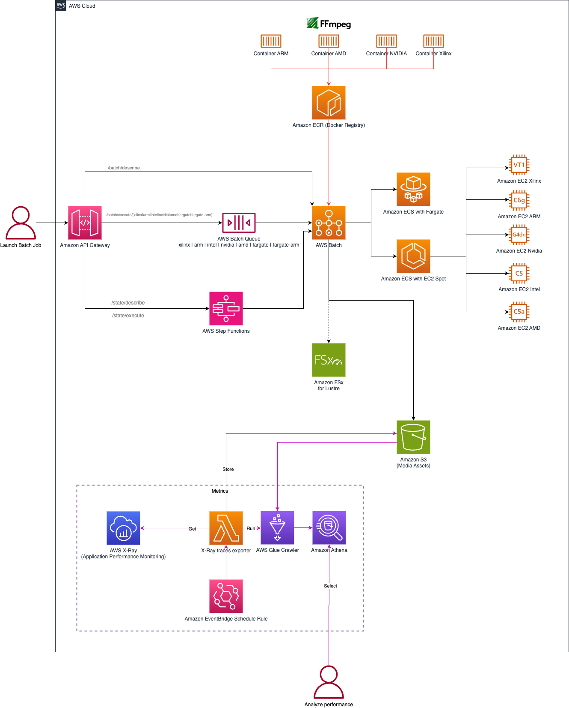

# Deploy a managed FFMPEG pipeline using multiple Amazon EC2 families with AWS Batch

After several discussions with customers, developers and video engineers continue to use FFMPEG, in parallel of using Amazon Elemental Media Services as a core framework to manipulate media assets. FFmpeg is an industry standard, open source, widely used utility for handling video. FFMPEG has many capabilities, including encoding and decoding all video compression formats, encoding and decoding audio, encapsulating, extracting audio and video from transport streams, and many more.

If AWS customers want to use FFMPEG on AWS, they have to maintain FFMPEG by themselves through an EC2 instances and develop a workflow manager to ingest and manipulate media assets. It's painful. In this repository, we developed a solution to integrate FFMPEG with AWS Services to build a managed FFMPEG by AWS. We propose a solution to deploy the FFMPEG command, packaged in a container and managed by AWS Batch. When finished, you will be able to execute a FFMPEG command as a job through a REST API.

We identified two use cases:
1. Use a managed FFMPEG solution as a toolbox to manipulate video assets
2. Use a managed FFMPEG solution to benchmark a ffmpeg command through different EC2 families to choose the most efficient and sustainable instance to perform the command in their own workflows.

In May 2022, AWS proposed 14 general usage instance families, 10 optimised compute instance families and 13 accelerated compute instance families. By correlating the specifications of each instance family with FFMPEG hardware acceleration, we understand that it is possible to optimize the performance of FFMPEG for several use cases:
- **P3** instances come equipped with the NVIDIA Tesla V100 GPU. The V100 is a 16 GB 5,120 CUDA Core-GPU based on the latest Volta architecture; well suited for video coding workloads. Other than being a mainstay in computational workloads the V100 offers enhanced hardware-based encoding/decoding (NVENC/NVDEC).
- **G4dn** instances are powered by NVIDIA T4 GPUs and Intel Cascade Lake CPUs
- **G4ad** instances are powered by the latest AMD Radeon Pro V520 GPUs and 2nd generation AMD EPYC processors.
- **VT1** are powered by up to 8 Xilinx® Alveo™ U30 media accelerator cards and support up to 96 vCPUs, 192GB of memory, 25 Gbps of enhanced networking, and 19 Gbps of EBS bandwidth. The [Xilinx Video SDK includes an enhanced version of FFmpeg](https://xilinx.github.io/video-sdk/v1.5/using_ffmpeg.html) that can communicate with the hardware accelerated transcode pipeline in Xilinx devices.
- **C5, C6i** instances are powered by 3rd generation Intel Xeon Scalable processors (code named Ice Lake) with an all-core turbo frequency of 3.5 GHz.
- **C6g, C7g** are powered by [AWS Graviton3](https://aws.amazon.com/ec2/graviton/)  which is the latest generation of AWS-designed Arm-based processors that provide the best price performance for workloads in Amazon EC2. 
- **M6a** instances are powered by 3rd generation AMD EPYC processors (code named Milan).
- **Fargate** allows to have a completely serverless architecture for your batch jobs. With Fargate, every job receives the exact amount of CPU and memory that it requests.

To help AWS Customers, we are going to create a managed file-based encoding pipeline using [AWS Batch](https://aws.amazon.com/batch) with FFMPEG in container images. As a starting point, this pipeline uses Intel (C5), Graviton(C6g) Nvidia (G4dn), AMD (C5a, M5a) and Fargate instance families.

## Disclaimer And Data Privacy Notice
When you deploy this solution, scripts will download different packages with different licenses from various sources. These sources are not controlled by the developer of this script. Additionally, this script can create a non-free and un-redistributable binary. By deploying and using this solution, you are fully aware of this.

## Architecture

The architecture includes 5 main components:

1. **Containers images** are stored in an Amazon ECR (Elastic Container Registry) registry. Each container includes the FFMPEG library with a Python wrapper. Container images are specialized per CPU architecture: ARM64, x86-64, NVIDIA.
1. **AWS Batch** is configured with a queue and compute environment per CPU architecture. AWS Batch schedules job queues using Spot Instance compute environments only to optimize cost.
1. Customers submit jobs through AWS SDKs with the 'SubmitJob' operation or use the **Amazon API Gateway REST API** to easily submit a job with any HTTP library.
1. All media assets ingested and produced are stored on a **Amazon S3** bucket.
1. Observability is managed by **Cloudwatch** and **X-Ray**. All XRay traces are exported on Amazon S3 to benchmark which compute architecture is better for a specific FFMPEG command.



## How to deploy

You need the following prerequisites to set up the solution:

- An [AWS account](https://signin.aws.amazon.com/signin?redirect_uri=https%3A%2F%2Fportal.aws.amazon.com%2Fbilling%2Fsignup%2Fresume&client_id=signup)  with privileges to create  [AWS Identity and Access Management](http://aws.amazon.com/iam)  (IAM) roles and policies. For more information, see  [Overview of access management: Permissions and policies](https://docs.aws.amazon.com/IAM/latest/UserGuide/introduction_access-management.html).
- Latest version of [AWS Cloud Development Kit (CDK)](https://docs.aws.amazon.com/cdk/v2/guide/getting_started.html) with a [bootstrap](https://docs.aws.amazon.com/cdk/v2/guide/bootstrapping.html) already done.
- Latest version of [Task](https://taskfile.dev/#/installation)
- Latest version of [Docker](https://docs.docker.com/get-docker/)

You can list all Task commands: `task --list`

To deploy the solution on your account, complete the following steps:

1. Clone the github repository http://github.com/aws-sample/aws-batch-with-ffmpeg/
1. Execute this list of commands:

```
task venv
source .venv/bin/activate
task cdk:deploy
task env
task app:docker
```

CDK will output the new Amazon S3 bucket and the Amazon API Gateway REST endpoint.

## How to use it

We can execute FFMPEG commands with the **AWS SDKs** or AWS CLI. In this example we use the Python SDK Boto3 and we want to delete the audio track of a video. First, we upload a video to the Amazon S3 bucket created by the solution, and complete the parameters below:

```python
s3_bucket_url = "<S3_BUCKET>" # Amazon S3 bucket created by the solution
s3_key_input = "<MEDIA_ASSET>" # Amazon S3 key of the media Asset uploaded on S3 bucket, to compute by FFMPEG command
s3_key_output = "<MEDIA_ASSET>" # Amazon S3 key of the result of FFMPEG Command
compute = "intel" # EC2 instance family I want to use
job_name = "no-audio"

command={
    'name': job_name,
    'input_url' : s3_bucket_url + s3_key_input,
    'output_url' : s3_bucket_url + s3_key_output,
    'output_file_options' : "-an",
}
```

We submit a FFMPEG command with the AWS SDK Boto3 (Python): 

```python
result = batch.submit_job(
    jobName=job_name,
    jobQueue=compute+'-batch-job-queue',
    jobDefinition=compute+'-batch-job-definition',
    parameters=command
)
```

We can also submit the same FFMPEG command with the REST API through a HTTP POST method:

```python
api_endpoint = "<API_ENDPOINT>" # Cloudformation output of the Amazon API Gateway REST API created by the solution
url= api_endpoint + compute + '/ffmpeg' 
response = requests.post(
  url=url,
  json=command
) 
```

By default, AWS Batch chooses an available EC2 instance type. If you want to override it, you can add the `nodeOverride` property when you submit a job with the SDK:

```python
instance_type = 'c5.large'
result = batch.submit_job(
    jobName=job_name,
    jobQueue=compute+'-batch-job-queue',
    jobDefinition=compute+'-batch-job-definition',
    parameters=command,
    nodeOverrides={
            "nodePropertyOverrides": [
                {
                    "targetNodes": "0,n",
                    "containerOverrides": {
                        "instanceType": instance_type,
                    },
                },
            ]
        },
    )
```

and with the REST API :

```python
command['instance_type'] = instance_type
url= <api_endpoint> + compute + '/ffmpeg'
response = requests.post(
  url=url,
  json=command
) 
```

**Quality Metrics**

AWS Customers also want to use this solution to benchmark the video encoding performance of Amazon EC2 instance families. We can analyze performance and video quality metrics thanks to AWS X-Ray service. We define 3 segments: Amazon S3 download, FFMPEG Execution and Amazon S3 upload.

If we switch the AWS SSM (Systems Manager) Parameter `/batch-ffmpeg/ffqm`to `TRUE`, quality metrics PSNR, SSIM, VMAF are calculated and exported as an AWS X-RAY metadata and as a JSON file in the Amazon S3 bucket with the key prefix `/metrics/ffqm`.

An Amazon EventBridge Crontab launches an AWS Lambda `application/metrics/metrics_lambda.py` to export all AWS X-Ray traces to Amazon S3, which can be read by Amazon Athena through an AWS Glue Crawler.


### Project

The app contains multiple Docker images in the directory `/application/docker-images`.

The FFMPEG wrapper is a Python script `/application/ffmpeg_wrapper.py` which downloads the source media asset from Amazon S3, launches the ffmpeg command and uploads the result to Amazon S3.

The CDK stack is described in the directory `/cdk`.
