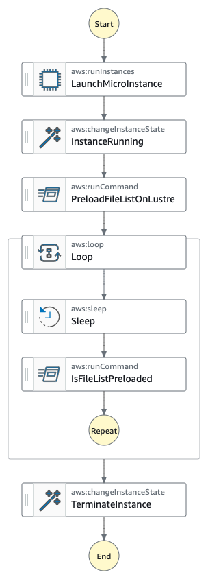

# 5. Implement FSx Lustre Scratch cluster

Date: 2023-11-29

## Context

When processing large media assets, it is preferable to avoid wasting compute time on uploading and downloading media to local storage. Rather, a shared file system where the media already resides is ideal.

## Decision

Amazon FSx for Lustre's scratch mode provides a cost-optimized storage solution for short-term, processing-intensive workloads. It functions by supplying a high-performance, shared file system accessible by multiple compute instances. Amazon FSx for Lustre can import and export media assets from an Amazon S3 bucket into a scratch file system. This allows efficient data processing by eliminating transfer time to and from local instance storage.

## Consequences

By leveraging both Lustre Scratch mode and S3, I can effectively manage the media asset lifecycle, storing frequently accessed assets on Lustre for rapid processing and archiving results on S3.
Combining Amazon FSx for Lustre Scratch mode with Amazon S3 provides a cost-effective, durable, and flexible solution for storing, processing, and sharing large media assets while optimizing resource utilization and ensuring data integrity.

The file release API for FSx for Lustre helps manage the data lifecycle by releasing file data that has been synchronized with Amazon S3. File release frees up storage space so that I can continue writing new data to the file system while retaining on-demand access to released files through the FSx for Lustre lazy loading from Amazon S3.

However the file preload API for FSx for Lustre doesn't exist. I create an Amazon System Manager Automation `batch-ffmpeg-lustre-preload` which launches a micro EC2 instance, mounts the Lustre filesystem, load the file on the filesystem with this shell command `lfs hsm_restore` and terminate the micro EC2 instance. Here is the Automation document:

